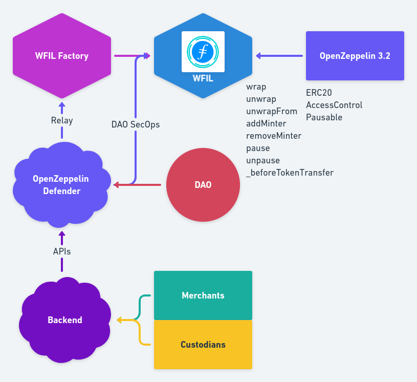

[](https://ubuntu.com/download/desktop)
[](https://github.com/nvm-sh/nvm#installation-and-update)
[](https://www.trufflesuite.com/)
[](https://github.com/ethereum/solidity/releases/tag/v0.6.12)
[](https://rinkeby.etherscan.io/address/0x48be7b803052C273F6Ff3e7baC99cA160931C3bf)


# WFIL

> Wrapped Filecoin, ERC20 Wrapper over Filecoin

`WFIL` is the first ERC20 wrapper over Filecoin, backed by filecoin deposits on a custodian wallet (1:1 ratio).  

The current iteration implements a custodial pattern where users need to send filecoin to a custodial wallet and they will automatically get the correspondent amount in `WFIL` to their ethereum addresses.  

Future Developments & Features:

We'd like to migrate to a non-custodial pattern where by leveraging Filecoin smart contracts we'd be able to implement a fully decentralized application.

Extend the Filecoin Wallet into a MetaMask for Filecoin.  

One of the features we're considering is to add the permit() function to WFIL to allow meta transactions by leveraging on OpenZeppelin ERC20Permit module (currently in progress) and incentivise adoption in the space.

Applications:

- Uniswap
- WFIL as Collateral on MakerDAO
- De-Fi
- ...

## Sections
* [Building Blocks](#building-blocks)
* [Setup](#setup)
* [About](#about)

## Building Blocks



### [WFIL](./contracts/WFIL.sol)

Implements an ERC20 token by leveraging on OpenZeppelin Library.  

It allows the owner of the contract, set as Default Admin to add/remove a Minter via **grantRole()**, **revokeRole()** functions by leveraging on *AccessControl* module by OpenZeppelin.  

The contract implements the **wrap()** function to mint WFIL by passing the recepient address and the amount of Filecoin to wrap as parameters and emitting an event, *Wrapped*.  

The contract also implements the **unwrap()** function to burn the WFIL by passing the filecoin address and the amount of WFIL to unwrap as parameters and emitting an event, *Unwrapped*.  

The contract inherits OpenZeppelin *AccessControl* module to set the Pauser role to the owner of the contract that can call the **pause()**, **unpause()** functions in case of emergency (Circuit Breaker Design Pattern).

Once the owner call the **pause()** function, thanks to the **_beforeTokenTransfer()** hook, *_mint()*, *_burn()* and *_transfer()* internal functions, will revert.  

To avoid users from sending *WFIL* to the contract address, **_transfer()** has been overridden to make sure the recipient address does not correspond to the contract address, and revert if it does.   

To manage the wrapping - unwrapping fee, the contract set the Fee Setter role to the owner of the contract that can set the fee via **setFee()** and the recipient via **setFeeTo()**. The fee is public and can be queried via the getter function **fee()**. 

A **Gnosis Safe Multisig** is used to receive and store the wrapping fees and set inside the constructor.

### Backend

Implements a custodial wallet by leveraging on Lotus APIs.  

Via AWS Lambda, allows to automatically wrap/unwrap Filecoin, by minting WFIL from an account set as Minter and calling the unwrap method to burn WFIL by the user.  

It's also connected to Filecoin via Lotus node to check for transactions that are tracked via Textile ThreadDB.

### [Interface](https://github.com/wfil/wfil-interface)

The Frontend has been implemented via Rimble UI & Rimble Web3 Components and deployed on IPFS via [Fleek](https://fleek.co/).

### [Filecoin Wallet](https://github.com/wfil/wfil-interface)

Implements a Filecoin client by leveraging Lotus APIs.  

Further developments of the project include building a MetaMask for Filecoin, creating an extension for Chrome.  


Setup
============

Clone this GitHub repository.

## Steps to compile and test

  - Local dependencies:
    - Truffle
    - Ganache CLI
    - OpenZeppelin Contracts v3.1.0
    - Truffle HD Wallet Provider
    - Truffle-Flattener
    - Truffle-Plugin-Verify
    - Solhint
    ```sh
    $ npm i
    ```
  - Global dependencies:
    - Truffle (recommended):
    ```sh
    $ npm install -g truffle
    ```
    - Ganache CLI (recommended):
    ```sh
    $ npm install -g ganache-cli
    ```
    - Slither (optional):
    ```sh
    $ git clone https://github.com/crytic/slither.git && cd slither
    $ sudo python3 setup.py install
    ```
    - MythX CLI (optional):
    ```sh
    $ git clone git://github.com/dmuhs/mythx-cli && cd mythx-cli
    $ sudo python setup.py install
    ```
## Running the project with local test network (ganache-cli)

   - Start ganache-cli with the following command (global dependency):
     ```sh
     $ ganache-cli
     ```
   - Compile the smart contract using Truffle with the following command (global dependency):
     ```sh
     $ truffle compile
     ```
   - Deploy the smart contracts using Truffle & Ganache with the following command (global dependency):
     ```sh
     $ truffle migrate
     ```
   - Test the smart contracts using Mocha & OpenZeppelin Test Environment with the following command:
     ```sh
     $ npm test
     ```
   - Analyze the smart contracts using Slither with the following command (optional):
      ```sh
      $ slither .
      ```
   - Analyze the smart contracts using MythX CLI with the following command (optional):
     ```sh
     $ mythx analyze
     ```
## Project deployed on Rinkeby
[WFIL](https://rinkeby.etherscan.io/address/0x48be7b803052C273F6Ff3e7baC99cA160931C3bf)

About
============
## Inspiration & References


[](https://github.com/wfil/awesome-wfil/blob/master/README.md#references)

## Authors

Project created by [Nazzareno Massari](https://nazzarenomassari.com) and [Cristiam Da Silva](https://cristiamdasilva.com/).  
Logo by Cristiam Da Silva.
